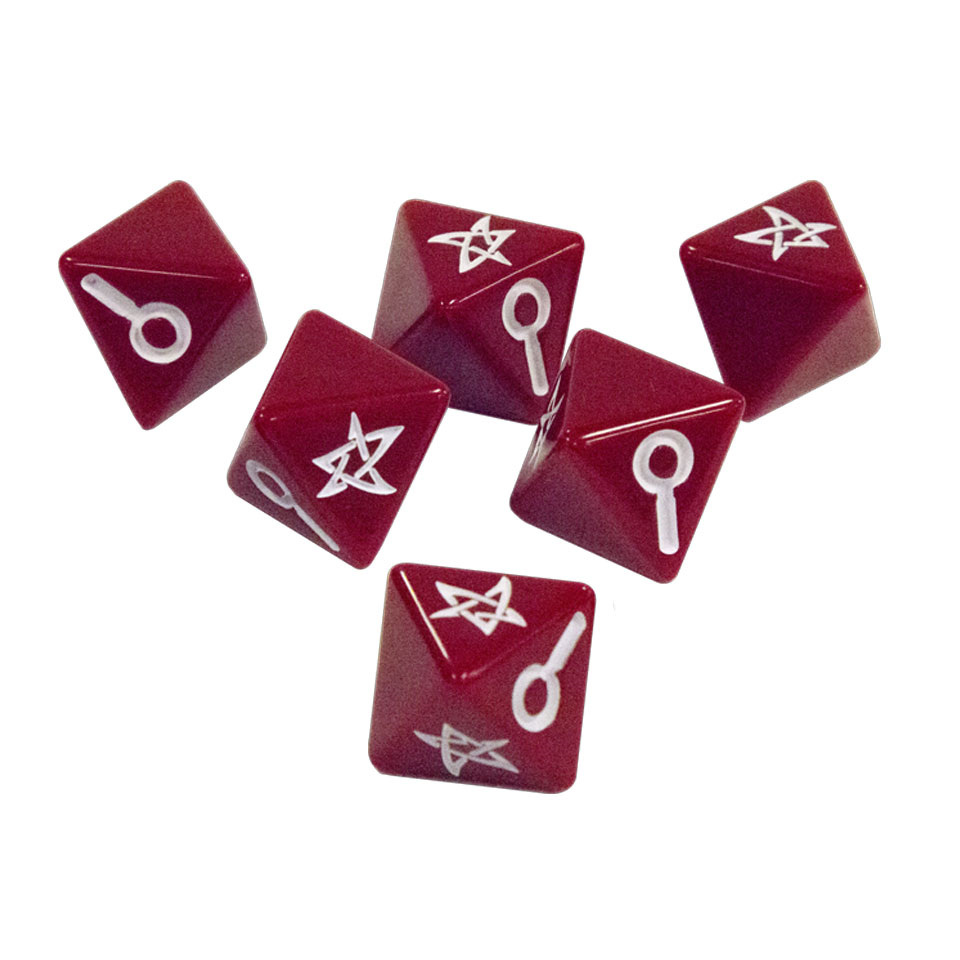
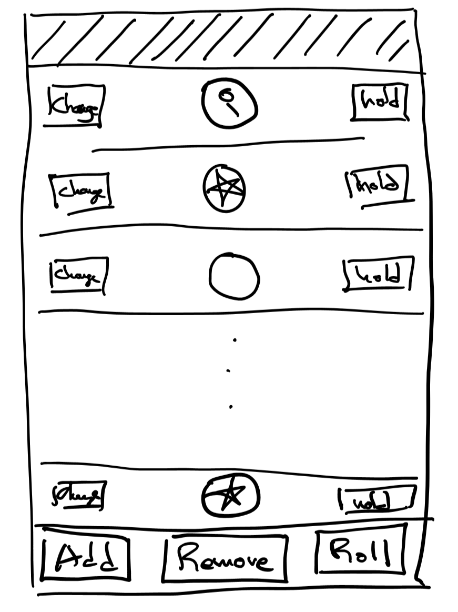

Android App - Mansions of Madness Dice
=======================================
A little while ago, I got into a board game called [Mansions of Madness](https://boardgamegeek.com/boardgame/83330/mansions-madness). The game is a bit like the classic [Clue](https://boardgamegeek.com/boardgame/1294/clue) where players roam around a house trying to solve some mystery. Progressing through the game, situations arise where the player will have to roll dice. The number of dice to roll ranges from 1 to probably like 10. Oddly, the game only includes 6 dice! This game be a perfect opportunity to build an dice roller app.



Requirements
=============
This dice app is specifically designed for Mansions of Madness gameplay.
* Custom 8 Sided Dice Mansions of Madness dice have three 3 face types.
  * Magnifying glass
  * Blank
  * Pagan Star
* **Roll Dice**: Players roll an 8 sided dice. The odds are: 3/8 Blank, 2/8 Magnifying, 3/8 Star.
* **Add/Remove Dice**
  * A player can add or remove dice from a roll.
  * Dice count is capped at 25.
* **Reroll**: Sometimes a player can reroll.
  * During a rerolls, a player may sometimes Keep a dice from the previous roll. For our app, we will include a "HOLD" Button.
  * Sometimes, a player gets the ability to change a dice roll from one result to another. Like, a player can change a magnifying glass into a star.

Design
=======
The app will be a vertical list of dice with buttons to trigger functions like "Roll Dice", "Add Dice" and "Remove Dice".



Implementation Steps
======================
0. Setup Project
1. Images: Dice faces [Magnifying Glass, Star, Blank]
2. Design and Layout
  * Container layout : Overall layout for the app.
  * Row layout: layout for each dice row.
3. Implement Dice list
  * ListView and Adapter Logic: the logic backing the [ListView](https://developer.android.com/reference/android/widget/ListView.html)
  * Add Dice object representation
4. Implement Buttons
  * Add dice
  * Remove dice
  * Hold Dice
  * Roll unHeld dice

Step 0 : Setup Project
============
The Android always seems to be shifting around. Just in case Android morphs into something that makes this tutorial obsolete, I'm outlining my dev environment.
* Android Studio V 3.1
* Gradle V 3.0.1
* Empty Activity Template

Step 1 : Images
==================
To start, I used a simple [SVG editor]() to draw out some dice faces. Then I imported them from svg's into VectorDrawables using Android Studio's Asset Studio.


Step 2 : Design and Layout
================

The Android initial empty activity template starts us off with a [````ConstraintLayout````](https://developer.android.com/reference/android/support/constraint/ConstraintLayout.html) root layout element. We'll need two components in this app: Dice area and controller Area. The dice area will be a scrollable dice list and the controller will be the 3 buttons "ADD" "REMOVE" "ROLL".


    <?xml version="1.0" encoding="utf-8"?>
    <android.support.constraint.ConstraintLayout
      xmlns:android="http://schemas.android.com/apk/res/android"
      xmlns:app="http://schemas.android.com/apk/res-auto"
      xmlns:tools="http://schemas.android.com/tools"
      android:layout_width="match_parent"
      android:layout_height="match_parent"
      tools:context=".MainActivity">
      <ListView
        android:id="@+id/dice_list"
        android:layout_height="0dp"
        android:layout_width="match_parent"
        app:layout_constraintBottom_toTopOf="@id/button_bar"
        app:layout_constraintLeft_toLeftOf="parent"
        app:layout_constraintRight_toRightOf="parent"
        app:layout_constraintTop_toTopOf="parent">
      </ListView>
      <LinearLayout
        android:id="@+id/button_bar"
        android:layout_width="match_parent"
        android:layout_height="@dimen/control_bar_height"
        android:orientation="horizontal"
        android:weightSum="3"
        app:layout_constraintBottom_toBottomOf="parent"
        app:layout_constraintLeft_toLeftOf="parent"
        app:layout_constraintRight_toRightOf="parent"
        app:layout_constraintTop_toBottomOf="@id/dice_list">
        <Button
          android:id="@+id/add_dice_button"
          android:layout_gravity = "center"
          android:layout_weight="1"
          android:layout_width="wrap_content"
          android:layout_height="wrap_content"
          android:text="ADD"/>
        <Button
          android:id="@+id/rem_dice_button"
          android:layout_gravity = "center"
          android:layout_weight="1"
          android:layout_width="wrap_content"
          android:layout_height="wrap_content"
          android:text="REM"/>
        <Button
          android:id="@+id/roll_dice_button"
          android:layout_weight="1"
          android:layout_gravity = "center"
          android:layout_width="wrap_content"
          android:layout_height="wrap_content"
          android:text="ROLL"/>
      </LinearLayout>
    </android.support.constraint.ConstraintLayout>


Row Layout
=======================


    <?xml version="1.0" encoding="utf-8"?>
    <RelativeLayout
      xmlns:android="http://schemas.android.com/apk/res/android"
      android:layout_width="match_parent"
      android:layout_height="@dimen/row_height">
      <FrameLayout
          android:layout_width="wrap_content"
          android:layout_height="@dimen/row_height"
          android:layout_alignParentStart="true"
          android:layout_centerVertical="true"
          android:padding="@dimen/row_padding">
          <Button
              android:id="@+id/dice_change_button"
              android:layout_width="wrap_content"
              android:layout_height="wrap_content"
              android:text="@string/change_button_label">
          </Button>
      </FrameLayout>

      <ImageView
          android:id="@+id/dice_icon"
          android:layout_centerInParent="true"
          android:layout_width="@dimen/image_width"
          android:layout_height="@dimen/image_height"
          android:src="@drawable/blank_dice"/>

      <FrameLayout
          android:layout_width="wrap_content"
          android:layout_height="@dimen/row_height"
          android:layout_alignParentEnd="true"
          android:layout_centerVertical="true"
          android:padding="@dimen/row_padding">
          <Button
              android:id="@+id/dice_hold_button"
              android:layout_width="wrap_content"
              android:layout_height="wrap_content"
              android:text="@string/hold_button_label">
          </Button>
      </FrameLayout>
    </RelativeLayout>

String and Dimension values

string.xml

    <resources>
      <string name="app_name">DiceRoller</string>
      <string name="hold_button_label">Hold</string>
      <string name="change_button_label">Change</string>
      <string name="add_button_label">ADD</string>
      <string name="rem_button_label">REM</string>
      <string name="roll_button_label">ROLL</string>
    </resources>

Dimen.xml

    <?xml version="1.0" encoding="utf-8"?>
    <resources>
      <dimen name="row_height">72dp</dimen>
      <dimen name="row_padding">16dp</dimen>
      <dimen name="control_bar_height">72dp</dimen>
      <dimen name="image_width">72dp</dimen>
      <dimen name="image_height">72dp</dimen>
    </resources>

Reading xml does take some getting use to. But each attribute describe some layout property for the layout element.

Why constraint layout

Step 3 ListView and Adapter
==============================
At this point, we've created a basic template Android Project with an Empty Activity and mocked out some layouts.  Next, we'll get into the logic and code. To start, I'd like to get into some more Android specific Java classes. [````ListView````](https://developer.android.com/reference/android/widget/ListView.html) is a basic layout class for rendering visual lists. The Android framework separates the visual components (````ListView````) and data components (````List<Dice>````) by employing an [Adapter Pattern](https://en.wikipedia.org/wiki/Adapter_pattern). In our case, all the adapter does is map the data(````Dice````) to some visual layout(````dice_row.xml````). In this case, the layout is described in a layout file.

    public class MainActivity extends AppCompatActivity {
        DiceAdapter diceAdapter;
        List <Dice> diceList = new ArrayList<>();

        @Override
        protected void onCreate(Bundle savedInstanceState) {
            super.onCreate(savedInstanceState);
            //associating activity to layout
            setContentView(R.layout.activity_main);

            //Setup ListView and Adapter
            ListView listView = findViewById(R.id.dice_list);
            diceAdapter = new DiceAdapter(this, R.layout.dice_row, diceList);
            listView.setAdapter(diceAdapter);

            //Initialize Data
            diceAdapter.add(new Dice());
        }

        public class DiceAdapter extends ArrayAdapter<Dice> {
            public DiceAdapter(@NonNull Context context, int resource, List<Dice> list) {
                super(context, resource, list);
            }

            @Override
            public View getView(final int position, View convertView, ViewGroup parent) {
                if (convertView == null) {
                    convertView = LayoutInflater.from(getContext()).inflate(R.layout.dice_row, parent, false);
                }

                return convertView;
            }
        }
    }


Step 3 Dice Object
===============================
The app will represent the dice state with Dice Objects. The Dice object needs to represent 2 things: dice value[Blank, Magnify, Star], and whether this dice value is being "Held". Functionally, the Dice has a roll method that will randomly select a dice face. Finally, we add a method that changes the dice value to the next on the list.

    MainActivity.java
    ....
    public static class Dice {
       public enum Face {
           BLANK,
           MAGNIFY,
           STAR
       }

       public static Random random = new Random();

       boolean hold = false;
       Face diceVal;

       Dice() {
           roll();
       }

       public void roll() {
           int num = random.nextInt(Face.values().length);
           this.diceVal = Face.values()[num];
       }

       public Face getValue() {
           return diceVal;
       }

       public void toggleHold() {
           hold = !hold;
       }

       public void nextValue() {
           int index = diceVal.ordinal();
           index = (index+1) % Face.values().length;
           diceVal = Face.values()[index];
       }
   }

Screenshot of app


Step 4 Buttons
=====================

In this step we map button clicks to logic. The Android platform offers a couple ways to do this. One way is to specify an attribute from the layout file. Another is to programmatically set the ````onClickListener````. In our case we use both approaches. I generally find that specifying the callback in the layout to be more convenient approach. However in out case we have buttons in each row. Since each dice row las slightly different logic, I programmatically set the listener.

Add Button
-------------
````addDice```` adds a new Dice object to the Dice array backing the Adapter.

Layout

    main_activity.xml
    ....
    <Button
      android:id="@+id/add_dice_button"
      android:layout_gravity = "center"
      android:layout_weight="1"
      android:layout_width="wrap_content"
      android:layout_height="wrap_content"
      android:text="@string/add_button_label"
      android:onClick="addDice"/>
    ....

Activity

    MainActivity.java
    ....
    public void addDice(View view) {
        diceAdapter.add(new Dice());
    }
    ....

Remove Button
----------
````removeDice```` removes the last dice from the list of Dice backing the Adapter.

Layout

    main_activity.xml
    ....
    <Button
       android:id="@+id/rem_dice_button"
       android:layout_gravity = "center"
       android:layout_weight="1"
       android:layout_width="wrap_content"
       android:layout_height="wrap_content"
       android:text="@string/rem_button_label"
       android:onClick="removeDice"/>
    ....

Activity

    ....
    public void removeDice(View view) {
           int index = diceList.size()-1;
           if(index >= 0) {
               diceAdapter.remove(diceAdapter.getItem(index));
           }
       }
    ....

Roll Button
----------
````rollDice```` takes each dice and rerolls it's value.

Layout

    ....
    <Button
        android:id="@+id/roll_dice_button"
        android:layout_weight="1"
        android:layout_gravity = "center"
        android:layout_width="wrap_content"
        android:layout_height="wrap_content"
        android:text="@string/roll_button_label"
        android:onClick="rollDice"/>
    ....

Activity

    ....
    public void rollDice(View view) {
        //roll all dice
        for(Dice dice : diceList) {
            if(!dice.hold)
                dice.roll();
        }

        //notify adapter to update view
        diceAdapter.notifyDataSetChanged();
    }
    ....

Explain Notify datasetchanged


Hold Button
----
Activity

    ....
    Button holdButton = convertView.findViewById(R.id.dice_hold_button);
    holdButton.setOnClickListener(new View.OnClickListener() {
        @Override
        public void onClick(View v) {
            Dice dice = diceList.get(position);
            dice.toggleHold();
        }
    });
    ....

Change Button
----
Activity

    ....
    Button changeButton = convertView.findViewById(R.id.dice_change_button);
    changeButton.setOnClickListener(new View.OnClickListener() {
        @Override
        public void onClick(View v) {
            Dice dice = diceList.get(position);
            dice.nextValue();
            diceAdapter.notifyDataSetChanged();
        }
    });
    ....


[Github  Source](https://github.com/sjan/Android-Ant-DiceRoller/tree/Part1)
